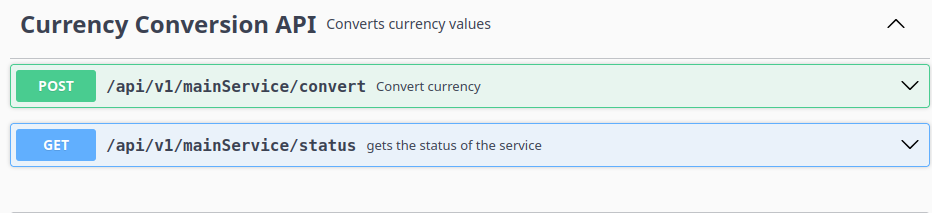
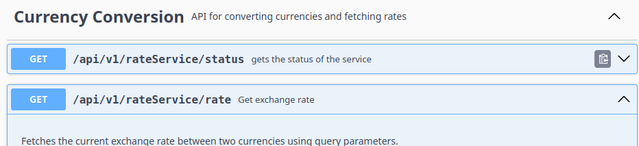
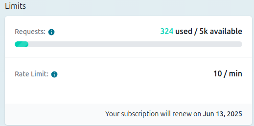
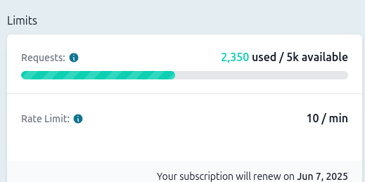

### fx exchange Microservice Platform

## Project Overview

This project implements a microservice-based platform for performing currency conversions. It consists of two core
services:

- `rate-service`: Responsible for fetching and caching real-time exchange rates from an external API.
- `main-service`: Handles conversion requests, applies business logic, interacts with the rate service, and persists
  conversion history.

The platform is designed with resilience, scalability, and cost-efficiency in mind, particularly addressing the
challenges associated with relying on rate-limited external data sources.

## Key Features

- Currency Conversion: Provides an API endpoint to convert an amount from one currency to another using the latest
  exchange rates.
- Real-time Exchange Rates: Fetches current exchange rates from [freecurrencyapi.com](https://freecurrencyapi.com).
- Intelligent Caching: Implements a background-aware lazy caching strategy using Caffeine. A scheduled job runs every 20
  minutes and fills only missing or stale values, minimizing external API calls and ensuring low-latency responses.
- Conversion History: Persists details of each conversion request to a PostgreSQL database using Spring Data JDBC. The
  schema is defined in `schema.sql`.
- Robust Validation and Error Handling: Uses Jakarta Bean Validation for input validation and `@ControllerAdvice` for
  centralized error handling and informative responses.
- API Security: Secures both services using API Key authentication to prevent unauthorized access.
- Logging: Logs application events to files with daily rolling policies for operational monitoring.
- Containerization: Provides `Dockerfile`s for each service and a `docker-compose.yml` for orchestrating services and
  PostgreSQL.
- Comprehensive Testing: Includes unit tests with mocks for external dependencies (API, Database) using JUnit and
  Mockito.
- Health Endpoints: Each service exposes a `/status` endpoint for basic health checks.

## Technical Stack

- Backend: Spring Boot (Java)
- API Client: Spring WebClient
- Caching: Caffeine
- Database: PostgreSQL
- Persistence: Spring Data JDBC
- Validation: Jakarta Bean Validation
- Security: Spring Security with API Key
- Logging: Logback (with file output and rolling policy)
- Containerization: Docker, Docker Compose
- Build Tool: Maven
- Testing: JUnit, Mockito, Spring Boot Test

## Architecture

The system is composed of two decoupled microservices:

- `rate-service`: Connects to the external API, caches results using Caffeine, and serves the latest exchange rates.
- `main-service`: Accepts conversion requests, fetches rates from `rate-service`, calculates converted values, and
  persists transaction details in PostgreSQL.

Each service is containerized and can be scaled independently. Communication between services is done via HTTP using
REST APIs.

## Endpoints

### rate-service

- GET /status: Returns the health status of the service.

- Response: { "status": "UP" }
- GET /rate?from={from}&to={to}: Retrieves the exchange rate between two currencies from freecurrencyapi.com, leveraging the caching layer.

- Requires API Key Authentication (used by main-service).
 Parameters:

- from (string, required): The base currency code (e.g., "USD").
to (string, required): The target currency code (e.g., "EUR").


Response: { "rate": 0.85 } (Example)
Note: This endpoint is primarily for internal use by main-service.

### main-service

- `GET /status`: Health check endpoint.
- `POST /convert`: Accepts a JSON body with `from`, `to`, and `amount`. Validates the request, fetches the exchange rate
  from `rate-service`, calculates the converted amount, and returns the result. Also persists the request to the
  database.

## Running the Project

To run this project locally using Docker Compose:

1. ### Prerequisites:

- Java 17+
- Maven 3.6+
- Docker Desktop (or Docker Engine and Docker Compose)
- An API Key from [freecurrencyapi.com](freecurrencyapi.com) (you'll need to sign up and obtain one).

2. ### Clone the Repository

```bash
git clone https://github.com/FrankMwangi8118/fx-exchange-system.git
cd fx-exchange-system 
```
- navigate to the rate-service to create the jar
```bash
cd rate-service
```
- run  mvn install 
```bash
mvn clean install -DskipTests
```
- navigate back to the root and into main-service
```bash
cd ..
cd main-service
```
- create the jar file
```bash
mvn clean install -DskipTests
```
navigate back to the root dir
```bash
cd ..
```
## 3.building /running the actual containers

```bash
cd DeploymentFiles
  ```
- in the directory we have an example env file and a docker-compose.yml file.
- fill in the appropriate variables in the env 
```bash
docker-compose build
```
run the containers
```bash
docker-compose up
```

4. ### Alternatively :Build Docker Images:
in each service there is a provided deploy.sh file
Use the provided deployment script to build the Docker images for both services:
for rate service

```bash
cd rate-service
chmod +x deploy.sh
./deploy.sh
```

for main-service

- make sure you are in the parent directory

```bash
cd main-service
chmod +x deploy.sh
./deploy.sh
```

(Alternatively, you can build manually:mvn clean package -DskipTests followed by docker-compose build)

### 5. Run with Docker Compose:

Start the services and the database using Docker Compose. This command reads variables from the .env file:

```bash
docker-compose up -d
```

- This will start the rate-service, main-service , and postgres containers. With the SPRING_SQL_INIT_MODE=always
  configuration , the schema.sql file will be automatically executed by Spring Data JDBC on main-service startup to set
  up the database table.

### 6. Verify Services:

- Check the status of rate-service: GET http://localhost:8081/api/v1/rateService/status (Expected: { "status": "UP" })
- Check the status of main-service: GET http://localhost:8080/api/v1/mainService/status (Expected: { "status": "UP" })

### 7.Accessing the API:

The main-service API is available at http://localhost:8080. You will need to provide the configured API Key
credentials (as configured in the security setup and.env file) to access the /convert endpoint.
## API Documentation
- Both main-service and rate-service include integrated Swagger UI for easy API exploration and testing.

-After running the services via Docker Compose or deployment scripts, access the documentation at:
Main Service Swagger UI:
http://localhost:8080/webjars/swagger-ui/index.html#


Rate Service Swagger UI:
http://localhost:8081/webjars/swagger-ui/index.html#


## logging
For better debugging and traceability, structured logs are enabled in both services. Logs are:

   - Written to files inside the container (mounted via ./logs)

   - Rolled daily to ensure clean and organized log history

   - Useful for tracking application behavior in production and development

You can view logs by navigating to the logs/ directory in the project root for every service.

## Technical Highlights & Design Decisions
 ### intelligent Background-Aware Lazy Caching (Caffeine).

A critical challenge when relying on external, rate-limited APIs like [freecurrencyapi.com](freecurrencyapi.com) is balancing data freshness with API usage constraints. A naive caching approach could still lead to frequent API calls for uncached pairs or cache misses.
This project implements a background-aware lazy caching strategy using Caffeine , specifically tailored to handle both frequently and infrequently requested currency pairs efficiently.

- **Cache Structure**:
  Exchange rates are stored in a nested map structure within the cache:
  **Map<String, Map<String, Double>>**
  , where the outer key is the 'from' currency, the inner map key is the 'to' currency, and the value is the exchange rate.

-  **Background Refresh**:
A scheduled job runs every 20 minutes. This job is designed to intelligently refresh rates for currency pairs that are
currently present in the cache
. This ensures that rates for actively used pairs (including major/mostly traded currencies that have been requested) are kept relatively fresh in the background, minimizing the need for synchronous API calls during user requests for these pairs.

Lazy On-Demand Fetching:
When a request comes in for a
from
/
to
currency pair:
- The cache is checked first. If the rate is found and is not expired, it's returned immediately (low latency).
- If the rate is not found in the cache (either never requested before, or evicted), the system performs a synchronous fetch from the external freecurrencyapi.com.
- Crucially, after a successful fetch for a previously uncached pair, the retrieved rate is added to the cache. This means the cache dynamically learns and grows based on actual user request patterns, storing rates for less common pairs after their first lookup.

 **Reduced API Load:** By prioritizing background refreshes for existing cache entries and handling initial fetches for new pairs on demand (and then caching them), the number of calls to the external API is significantly reduced compared to fetching every time or only caching a fixed set.
- Improved Resilience: If the background job fails or the external API is temporarily unavailable, the system can still serve slightly stale data from the cache, providing graceful degradation.
- Scalability: The caching layer absorbs most read load, allowing the rate-service to handle a high volume of requests without overwhelming the external API.

**the images..some numbers may look like exagerated but test was done for almost equal periods.** 


**before using caching**



**Result:**
This strategy successfully reduced the probability of hitting the external API rate limit from an estimated 80% (with a naive approach) to
under 5%
, while maintaining low latency for users and ensuring the system is resilient, adaptive, and cost-efficient under load. The dynamic caching of requested pairs ensures the cache becomes more effective over time based on real-world usage.

## Future Enhancements

- **Distributed Caching with Redis**:
Explore and implement a distributed caching solution like
Redis
to allow the
rate-service
to scale horizontally while maintaining a shared cache state. This would further improve resilience and performance under high load across multiple instances.

- **API Rate Limiting**:
  Implement
  rate limiting
  on the
  main-service
  API (e.g., using Spring Cloud Gateway or a library like Bucket4j) to protect the service from abuse and ensure fair usage among clients.

- **Schema Migrations**:
  Introduce a database migration tool like
  Flyway or Liquibase
  to manage database schema evolution in a more controlled and versioned manner, which is crucial for production environments.

Contact
- name: Frank mwangi
- LinkedIn: https://www.linkedin.com/in/frank-mwangi-dev/
- Email: frankmwangi@gmail.com